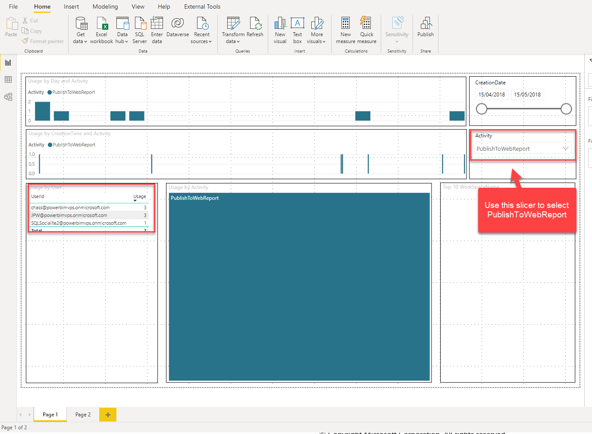
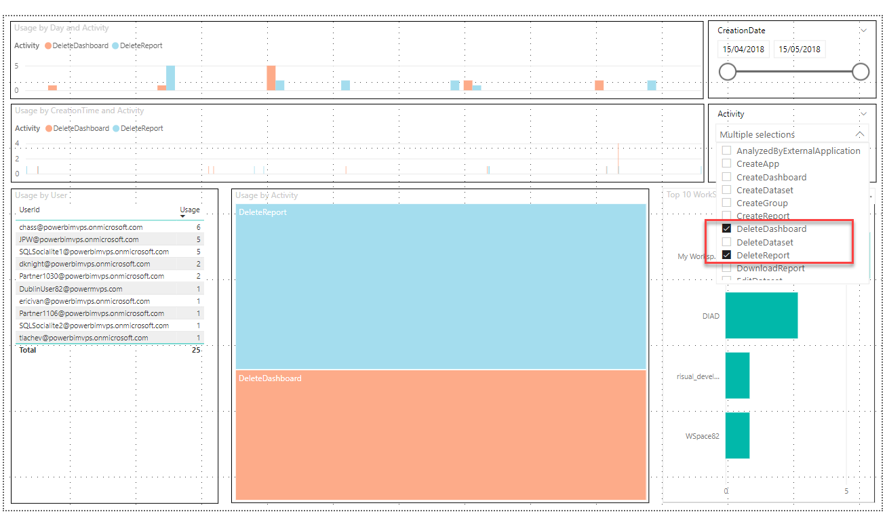

# Usage Monitoring & Auditing

Let’s use Power BI   audit Log to answer a few questions.

### Problem: Data is leaked to the internet. How to identify the issue?

1. Open PowerBIAuditLog.pbix (file located in Assets folder). You can download this file from here https://gethynellis.sharepoint.com/:u:/s/StLukesHealthCare/EXC_phl8CL5LvZNTjh25ObsBi26lcPStsZK8nZG7DCrQyQ?e=RiZOoX

2. Publish to Web is a feature where data can be accessed without entering credentials. So, let’s look for this activity.

3. From Activity slicer, select to PublishToWebReport.

4. Notice there a few users who have published to web. 

5. Publish to web might be a legimate requirement but you will want to track who is publishing to the web so you monitor and take action if necessary. You can work with these users to investigate further.

### Dashboards and Reports are being deleted. Who is doing it?

1. From Activity slicer, select to DeleteDashboard and DeleteReport.

2. This will give a list of users who have deleted reports and dashboards. You can work with these users and investigate further.

3. Remove all filters once done.

### How many users have Opted to use Pro trial?

1. From Activity slicer, select to OptInForProTrial.

2. Notice there are several users who have used Pro Trial and a couple of them have extended their Pro trial. So you might want to think about providing them Pro licenses before they lose the trial licenses.

4. Remove all filters once done.

### Does user SQLSocialite2 need to be upgraded to Pro license?

10. From Usage by User table, select SQLSocialiate2.
11. Notice the user is not just viewing reports and dashboards but is also performing Pro level activity like creating  datasets and reports across multiple 
workspaces. This user is making use of Pro features. It will make sense to upgrade to Pro license.

### Explore the A

### Congratulation you have completed the Exercise

Use the Microsoft Admin Center explore the Audit log for the aiaddemo capacity.

