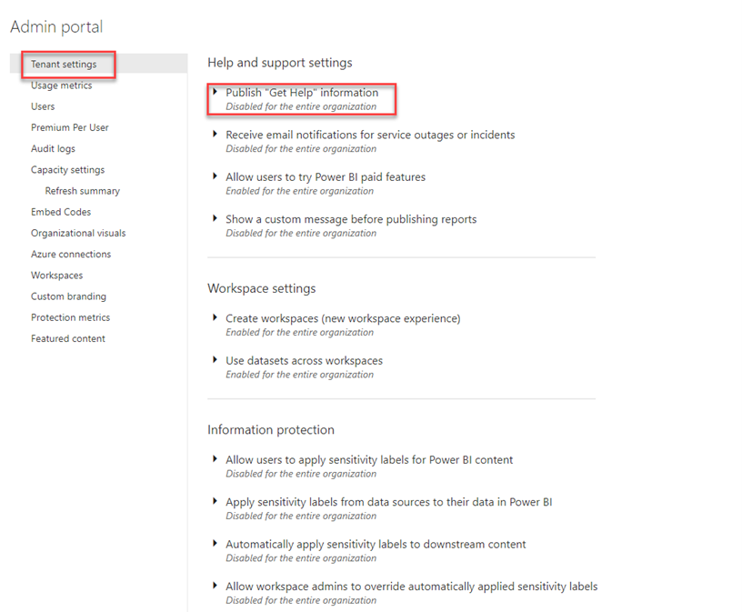
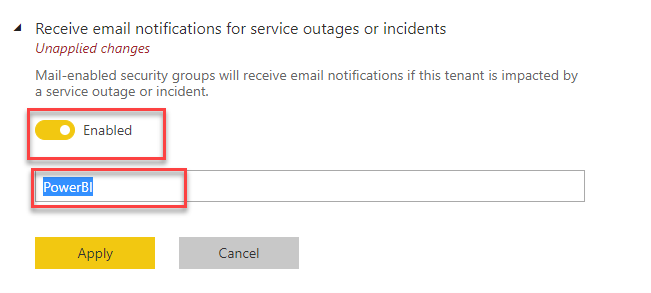

# Module  6 – Configuring Tenant Settings 

You will sign into powerbi.com using the student#@gethynellis.co.uk login provided to you by your instructor

## Publish "get help Information"

1. Sign into powerbi.com

2. Go to the **admin portal** and select **tenant settings**

3.Expand Publish **Get Help**

4.You should have four text boxes you can use to set URLs to direct users to get help, including training documents and licensing request

## Mange Risk – receive email notifications for service outages

1.	Expand Receive email notifications for service outages or incidents

2.	When you enable this setting you will prompted to enter a a security group

3.	Select the group you want to get alerts in the event of an outage

## Information Protection
There are several  tenant settings that relate to information and protection and are off by default. Leave them off but explore if these are turned on for your tenant

### Create Workspaces
You can restrict users from creating workspaces. Or limited to specific groups

### Sharing Content
Can user publish to the web in this tenant

### Developer Settings
What developer settings are enabled on the tenant

