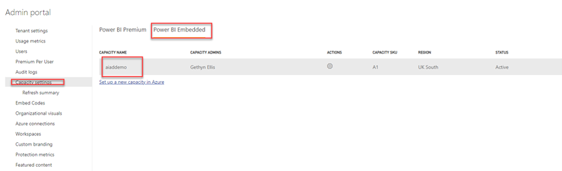

# Module 7 Administering Power BI Capability

In this task you will use the Azure portal to access the capacity to retrieve the resources that the capacity has available. 

## Azure Portal

Using the portal answer the following question

What is the name of the capacity? _____________________________________
What SKU is the capacity using? _______________________________________ (Please do not change the capacity Settings)
Which location is the capacity running?______________________________________________

## Admin Portal

Switch to Powerbi.com in your browser, navigate to the Admin Portal and select capacity settings

Expand the notification settings are there any notification set for the capacity?
