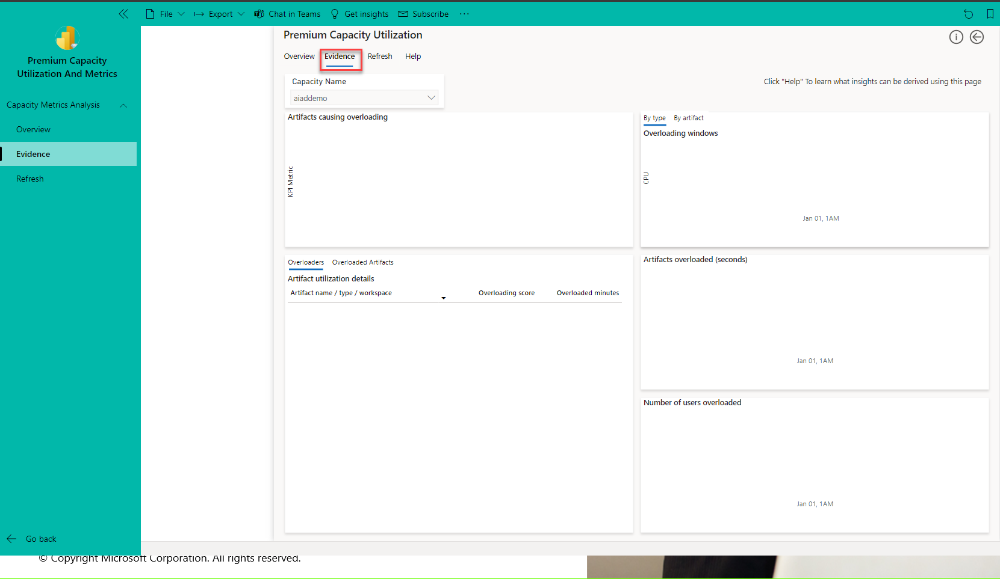
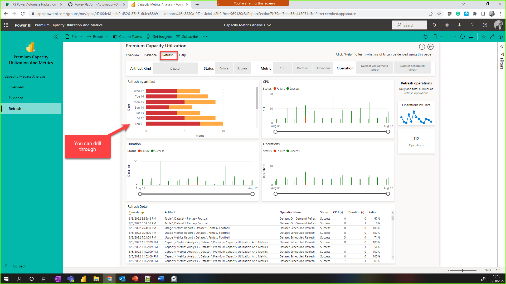
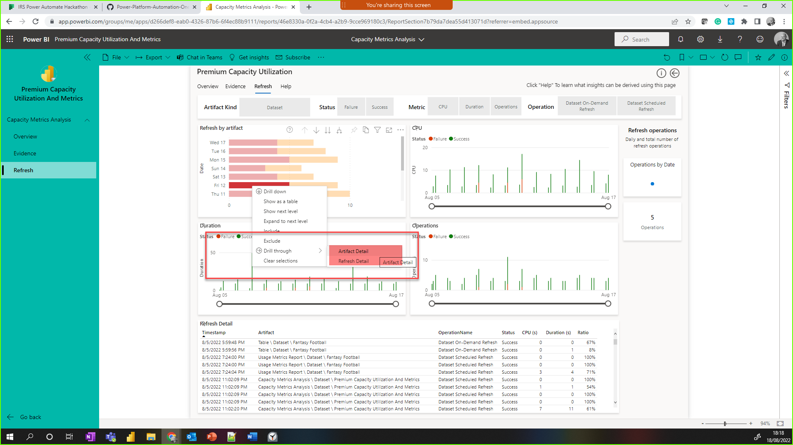

## Premium Capacity

### Task 1: Login and explore the Premium Capacity Applications on the aiaddemo tenant

*ACTIVITY: If you have privileges in your tenant, install and analyze your capacity using Power BI Premium Capacity Metrics app.

**We have this installed already on our capacity so please make sure you save it to a new workspace**

1. Login to https://app.powerbi.com 

2. Navigate to Apps section in the left pane. You will see that Premium Capacity Utilization and Metrics App is installed. Please feel free to seach for app but don't install any othersWhen your happy move to the next task. The following steps will talk you through installing the app. **You do not need to do this, steps 5,6 and 7 are for information only. **

3. Select Get Apps in the top right of the screen
 
4. Under Apps, search for Power BI Premium Capacity Utilization and Metrics app.

5. Select Get it now under Power BI Premium Capacity Utilization and Metrics app.

**You will need to be a capacity admin to get the app to work.**

### Task 2 Using the  Power BI Premium Capacity Utilization and Metrics app

1. Once the app is installed click on the tile.
2. The app has six  pages:
  - Overview
  - Evidence
  - Refresh
  - Help
  - Artifact Detail
  - Refresh Detail

![Premium Capacity Utilization and metrics Application (Images/AppPages.png)

3. Make sure that aiademo capcity is selected

4. The  **Overview** page will open by default. The **Overview** page provides capacity performance. It is broken  down into three sections: **Artifacts**, **Performance** and **CPU over Time**.

5. Click on the **Evidence** page The Evidence page provides information about overloads in your capacity.  You can use it to establish which Power BI items (such as reports, dashboards, and datasets) cause overload, and which items are affected by this overload.

 
6. Click on the **Refresh** page. The Refresh page is designed to help you identify aspects concerning refresh performance such as refresh CPU consumption power.

7. Right-click on **Refresh by artifact** visual, select drill through and select **Artifact Detail** This page shows a view of everything that happened to the idividual artefact over the last two weeks. Click the **Help** page to get a detail description of this page and what it shows

